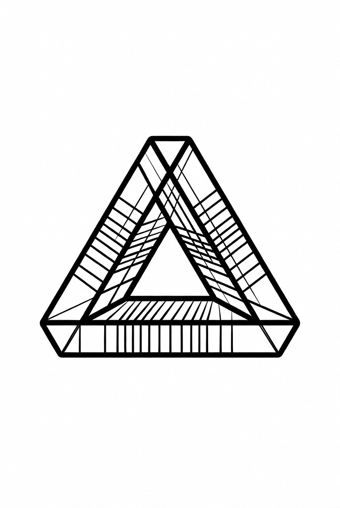

<div align="center">



# Triangle

### An agentic development engine for Three.js

Triangle is a desktop-first environment purpose-built to make AI coding and creative
agents reliably effective at shader-heavy, interactive 3D web work — pairing a
high-fidelity live Three.js preview with a harness-agnostic agent layer.

<br />

[](docs/ROADMAP.md)
[](LICENSE)
[](https://www.electronjs.org/)
[](https://threejs.org/)
[](https://www.typescriptlang.org/)
[](#contributing)

<br />

<!-- Replace this placeholder with a real screenshot or GIF, e.g. docs/assets/screenshot.png -->


<sub>📸 Screenshot placeholder — swap in a real capture of the app here</sub>

</div>

---

> [!NOTE]
> **Building in public.** Triangle is an early-stage work in progress, shipped in
> incremental stages that each produce usable value. Follow along, open issues, and
> send PRs — the roadmap is public and the architecture decisions are documented as
> ADRs.

## Highlights

- 🔺 **Live Three.js preview** — hot-reloads from local files, with orbit controls,
  pause/grid toggles, screenshots, and an FPS / draw-call / triangle-count HUD.
- ✍️ **Monaco editor** — JS / TS / GLSL with syntax highlighting, a dirty/save model,
  and a `suppressWatch` save path that hot-reloads without churn.
- 🤖 **Harness-agnostic agents** — Claude Agent SDK + Codex CLI (and a zero-setup Mock
  agent) that read and edit the project behind a **human-approval gate**.
- 🧱 **Dockable workspace** — resizable, movable, dockable, floatable, collapsible
  panes (powered by [dockview](https://dockview.dev)) with a persisted layout.
- 🎨 **Centralized theming** — a single CSS-variable design system; the Monaco theme
  tracks the same palette.
- 🔒 **Security-conscious** — the renderer never touches Node directly; all privileged
  work crosses a typed IPC bridge in the main process.

## Layout

```
┌──────────┬──────────────┬────────────────────────┬──────────────┐
│          │              │                        │              │
│ Explorer │  Mini-editor │  Three.js live preview │  AI agent    │
│  (tree)  │  (Monaco)    │  (hot-reload, orbit,   │  panel       │
│          │              │   screenshot, stats)   │  (chat +     │
│          │              │                        │   harness)   │
└──────────┴──────────────┴────────────────────────┴──────────────┘
       resizable · movable · dockable · collapsible (dockview)
```

## Quick start

> **Prerequisites:** Node.js ≥ 20 (developed on 24) and pnpm ≥ 9 (`npm i -g pnpm`).

```bash
pnpm install          # install all workspace deps
pnpm dev              # launch the Electron app in dev mode (HMR)
```

Try the loop: open `src/main.js` in the explorer, edit + save (`Cmd/Ctrl+S`) → the
preview hot-reloads. In the agent panel, pick a harness, ask for a change, and approve
the write when prompted.

Other useful scripts:

```bash
pnpm build            # build all packages + the desktop app
pnpm typecheck        # typecheck every workspace package
pnpm package          # produce a distributable build (electron-builder, Stage 5)
```

### Agent credentials

Credentials are read from the environment or a gitignored config — **never committed**.
The Claude harness needs `ANTHROPIC_API_KEY`; the Codex harness needs the `codex` CLI on
`PATH`. See [`docs/STAGE-2.md`](docs/STAGE-2.md#configuration-credentials) for the full
precedence and key list.

## Status & roadmap

| Stage | Theme | Status |
| :---- | :---- | :----: |
| 0 | Foundations & architecture | ✅ |
| 1 | Core shell & live preview | ✅ |
| 2 | Editor + basic agent orchestration | ✅ |
| 2.5 | Visual & layout overhaul (design system + dockview) | ✅ |
| 3 | Three.js domain tooling & visual feedback loop | ⬜ Next |
| 4 | Rich agent capabilities & protocol support (ACP / MCP) | ⬜ |
| 5 | Polish, rich features & internal prototype | ⬜ |
| 6 | Post-prototype hardening & web path | ⬜ |

The full roadmap lives in [`docs/ROADMAP.md`](docs/ROADMAP.md). Stage write-ups:
[Stage 1](docs/STAGE-1.md) · [Stage 2](docs/STAGE-2.md) ·
[Stage 2.5](docs/STAGE-2.5-visual-overhaul.md).

## Architecture

This is a [pnpm](https://pnpm.io) workspace monorepo.

```
triangle/
├── apps/
│   └── desktop/            # Electron app (main + preload + React renderer)
├── packages/
│   ├── shared/             # Shared TS types: IPC contract + agent tool schemas
│   └── preview-runtime/    # Framework-agnostic Three.js preview engine
├── templates/
│   └── starter/            # Default Three.js project loaded by the preview
└── docs/                   # ADRs, roadmap, and stage notes
```

Key decisions are recorded as Architecture Decision Records in
[`docs/adr/`](docs/adr/) — covering the [tech stack](docs/adr/0002-tech-stack.md), the
[process model & IPC](docs/adr/0003-process-model-and-ipc.md), the
[editor & GLSL](docs/adr/0004-editor-and-glsl.md), [agent orchestration](docs/adr/0005-agent-orchestration.md),
and the [design system & dock layout](docs/adr/0006-visual-design-and-dock-layout.md).

## Contributing

Issues and pull requests are welcome. A good flow:

1. Open an issue to discuss non-trivial changes first.
2. Keep diffs focused; match the existing code style.
3. Run `pnpm typecheck` and `pnpm build` before submitting.
4. Add or update an ADR for any significant architectural decision.

## License

[MIT](LICENSE) © Triangle contributors.
